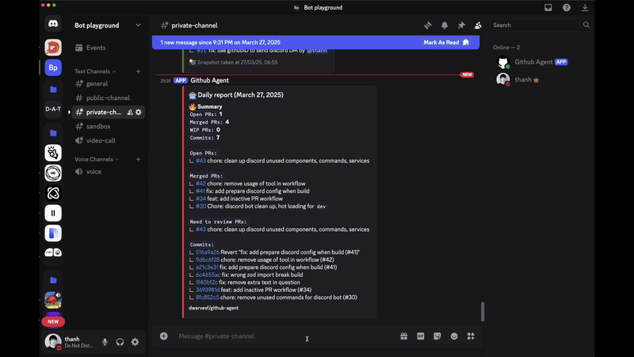

<h1 align="center">
    Github Agent
</h1>
<p align="center">
    <a href="https://github.com/dwarvesf" style="text-decoration: none">
        
    </a>
    <a href="https://discord.gg/dwarvesv" style="text-decoration: none">
        
    </a>
</p>

<p align="center">
 
</p>

An intelligent agent designed to enhance the reminder and notification workflow
for development teams on GitHub. Key features:

- Automated reminders for development blockers (code reviews, merge conflicts,
  etc)
- Pull request monitoring and review notifications
- Project progress tracking with work summaries

## Getting Started

### Prerequisites

- Node.js (v20.0+)
- pnpm (v8.0+)
- GitHub Token & OpenAI API Key (for agent app)
- Discord Bot Token (for discord-bot app)

### Setup

1. Clone the repository:

```bash
git clone git@github.com:dwarvesf/github-agent.git
cd github-agent
```

2. Install dependencies:

```bash
pnpm install
```

3. Obtain service tokens:

- Get your [OpenAI API key](https://platform.openai.com/api-keys) (or the LLM
  provider of your choice)

- Get your [GitHub API token](https://github.com/settings/tokens) with necessary
  permissions to access the desired repositories

- Create a
  [Discord app](https://discord.com/developers/docs/quick-start/getting-started)
  and obtain the token and ID

4. Copy environment files:

```bash
cp apps/agent/.env.example apps/agent/.env
cp apps/discord-bot/.env.example apps/discord-bot/.env
```

5. Configure environment variables:

- Set up GitHub tokens and configurations in `apps/agent/.env`
- Configure Discord bot settings in `apps/discord-bot/.env`

6. Start development:

```bash
pnpm dev
```

## Project Structure

### Apps

- `agent`: Core automation service using Mastra framework
- `discord-bot`: Discord integration service for notification

### Packages

- `eslint-config`: Shared ESLint configurations
- `typescript-config`: Shared TypeScript configurations

## Development

- `pnpm dev`: Start all applications in development mode
- `pnpm build`: Build all applications and packages
- `pnpm lint`: Run linting
- `pnpm format`: Format code with Prettier

## Contributing

We welcome contributions! Please read our [Contributing Guide](CONTRIBUTING.md)
for details on our code of conduct and the process for submitting pull requests.
