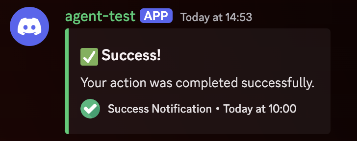
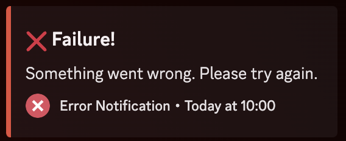
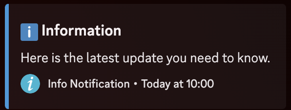
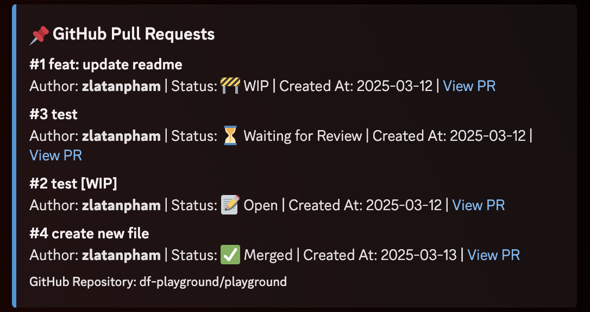
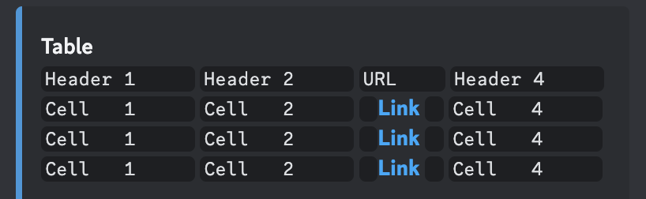
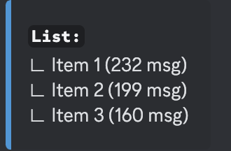
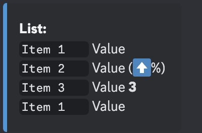

# Discord Bot

This package is based on
[Kevin Novak's Discord-Bot-TypeScript-Template](https://github.com/KevinNovak/Discord-Bot-TypeScript-Template).

## Setup

1. Create a `config.json` file in the `/apps/discord-bot/config/` directory
   using `config/config.example.json` as a template.
2. Set up your Discord bot credentials and other configurations in this file.

## Commands

From the root of the monorepo, you can run the following commands:

```bash
# Development
pnpm --filter discord-bot dev

# Build
pnpm build

# Register Discord bot commands
pnpm --filter discord-bot commands:register

# View registered commands
pnpm --filter discord-bot commands:view

# Other available commands
pnpm --filter discord-bot commands:rename  # Rename commands
pnpm --filter discord-bot commands:delete  # Delete commands
pnpm --filter discord-bot commands:clear   # Clear all commands
```

## Configuration

See the original template's documentation for detailed information on
configuration options and bot features:
[Discord-Bot-TypeScript-Template Documentation](https://github.com/KevinNovak/Discord-Bot-TypeScript-Template)

## Running with PM2

You can use PM2 to manage the bot process:

```bash
# Start with PM2
pnpm --filter discord-bot start:pm2

# Stop PM2 processes
pnpm --filter discord-bot pm2:stop

# Delete PM2 processes
pnpm --filter discord-bot pm2:delete
```

## Webhooks

This bot uses webhooks to send messages to Discord

**Message format:**
`"Test message to User <@!user_id> In Channel <#channel_id>"`

**Embed format:**

```json
{
  "embeds": [
    {
      "title": "Embed Title",
      "description": "This is the embed description.",
      "url": "https://example.com",
      "color": 16711680,
      "timestamp": "2025-03-13T12:00:00.000Z",
      "footer": {
        "text": "Footer Text",
        "icon_url": "https://example.com/footer-icon.png"
      },
      "image": {
        "url": "https://example.com/image.png"
      },
      "thumbnail": {
        "url": "https://example.com/thumbnail.png"
      },
      "author": {
        "name": "Author Name",
        "url": "https://example.com",
        "icon_url": "https://example.com/author-icon.png"
      },
      "fields": [
        {
          "name": "Field 1",
          "value": "This is the value for field 1.",
          "inline": true
        },
        {
          "name": "Field 2",
          "value": "This is the value for field 2.",
          "inline": true
        },
        {
          "name": "Field 3",
          "value": "This is the value for field 3.",
          "inline": false
        }
      ]
    }
  ]
}
```

**Webhook Examples:**

```bash
# Send message to a channel
curl -X POST http://localhost:3000/webhook/channel -H "Content-Type: application/json" -d '{"channelId": "channel_id", "message": "Test message to <@!user_id> In <#channel_id> channel"}'

# Send message with embed to a channel
curl -X POST http://localhost:3000/webhook/channel -H "Content-Type: application/json" -d '{"channelId": "channel_id", "message": "Test message to <@!user_id> In <#channel_id> channel", "embed": {"title": "Test Embed", "description": "This is a test embed"}}'

# Send message to a user
curl -X POST http://localhost:3000/webhook/user -H "Content-Type: application/json" -d '{"userId": "user_id", "message": "Test message to <@!user_id> In <#channel_id> channel"}'

# Send message with embed to a user
curl -X POST http://localhost:3000/webhook/user -H "Content-Type: application/json" -d '{"userId": "user_id", "message": "Test message to <@!user_id> In <#channel_id> channel", "embed": {"title": "Test Embed", "description": "This is a test embed"}}'
```

### Embed templates

**Success:**



```bash
curl -X POST http://localhost:3000/webhook/channel \
     -H "Content-Type: application/json" \
     -d '{
       "channelId": "channel_id",
       "embed": {
         "title": "✅ Success!",
         "description": "Your action was completed successfully.",
         "color": 3066993,
         "timestamp": "2025-03-13T03:00:32Z",
         "footer": {
           "text": "Success Notification",
           "icon_url": "https://cdn-icons-png.flaticon.com/512/190/190411.png"
         }
       }
     }'
```

**Fail:**



```bash
curl -X POST http://localhost:3000/webhook/channel \
     -H "Content-Type: application/json" \
     -d '{
       "channelId": "channel_id",
       "embed": {
         "title": "❌ Failure!",
         "description": "Something went wrong. Please try again.",
         "color": 15158332,
         "timestamp": "2025-03-13T03:00:32Z",
         "footer": {
           "text": "Error Notification",
           "icon_url": "https://cdn-icons-png.flaticon.com/512/463/463612.png"
         }
       }
     }'
```

**Info:**



```bash
curl -X POST http://localhost:3000/webhook/channel \
     -H "Content-Type: application/json" \
     -d '{
       "channelId": "channel_id",
       "embed": {
         "title": "ℹ️ Information",
         "description": "Here is the latest update you need to know.",
         "color": 3447003,
         "timestamp": "2025-03-13T03:00:32Z",
         "footer": {
           "text": "Info Notification",
           "icon_url": "https://cdn-icons-png.flaticon.com/512/189/189664.png"
         }
       }
     }'
```

**GitHub Pull Requests preview:**



```bash
curl -X POST http://localhost:3000/webhook/channel \
  -H "Content-Type: application/json" \
  -d '{
    "channelId": "964734967517167616",
    "embed": {
      "title": "📌 GitHub Pull Requests",
      "color": 3447003,
      "fields": [
        {
          "name": "#1 feat: update readme",
          "value": "Author: **zlatanpham** | Status: 🚧 WIP | Created At: 2025-03-12 | [View PR](https://github.com/df-playground/playground/pull/1)",
          "inline": false
        },
        {
          "name": "#3 test",
          "value": "Author: **zlatanpham** | Status: ⏳ Waiting for Review | Created At: 2025-03-12 | [View PR](https://github.com/df-playground/playground/pull/3)",
          "inline": false
        },
        {
          "name": "#2 test [WIP]",
          "value": "Author: **zlatanpham** | Status: 📝 Open | Created At: 2025-03-12 | [View PR](https://github.com/df-playground/playground/pull/2)",
          "inline": false
        },
        {
          "name": "#4 create new file",
          "value": "Author: **zlatanpham** | Status: ✅ Merged | Created At: 2025-03-13 | [View PR](https://github.com/df-playground/playground/pull/4)",
          "inline": false
        }
      ],
      "footer": {
        "text": "GitHub Repository: df-playground/playground"
      }
    }
  }'
```

**Table**



```bash
curl -X POST http://localhost:3000/webhook/channel \
  -H "Content-Type: application/json" \
  -d '{
    "channelId": "964734967517167616",
    "embed": {
      "color": 3447003,
      "fields": [
        {
          "name": "Table",
          "value": "`Header 1     ` `Header 2     ` `URL    ` `Header 4     `\n`Cell   1     ` `Cell   2     ` ` `[**Link**](http://example.com) ` ` `Cell   4     `\n`Cell   1     ` `Cell   2     ` ` `[**Link**](http://example.com) ` ` `Cell   4     `\n`Cell   1     ` `Cell   2     ` ` `[**Link**](http://example.com) ` ` `Cell   4     `",
          "inline": false
        }
      ]
    }
  }'
```

**List**



```bash
curl -X POST http://localhost:3000/webhook/channel \
  -H "Content-Type: application/json" \
  -d '{
    "channelId": "964734967517167616",
    "embed": {
      "color": 3447003,
      "fields": [
        {
          "name": "`List:`",
          "value": "∟ Item 1 (232 msg)\n∟ Item 2 (199 msg)\n∟ Item 3 (160 msg)",
          "inline": false
        }
      ]
    }
  }'
```



```bash
curl -X POST http://localhost:3000/webhook/channel \
  -H "Content-Type: application/json" \
  -d '{
    "channelId": "964734967517167616",
    "embed": {
      "color": 3447003,
      "fields": [
        {
          "name": "**List:**",
          "value": "`Item 1   ` Value\n`Item 2   ` Value (⬆️%)\n`Item 3   ` Value **3**\n`Item 1   ` Value",
          "inline": false
        }
      ]
    }
  }'
```
